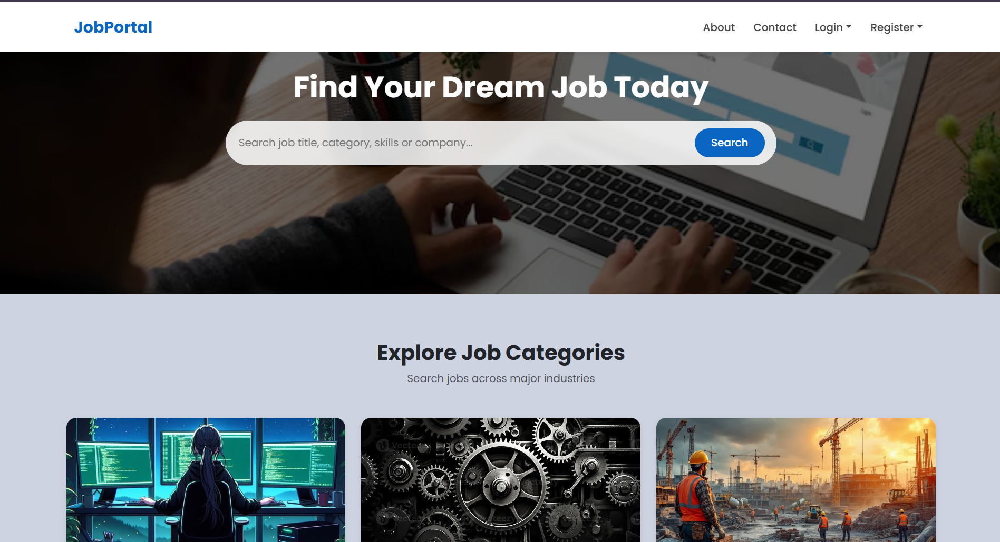
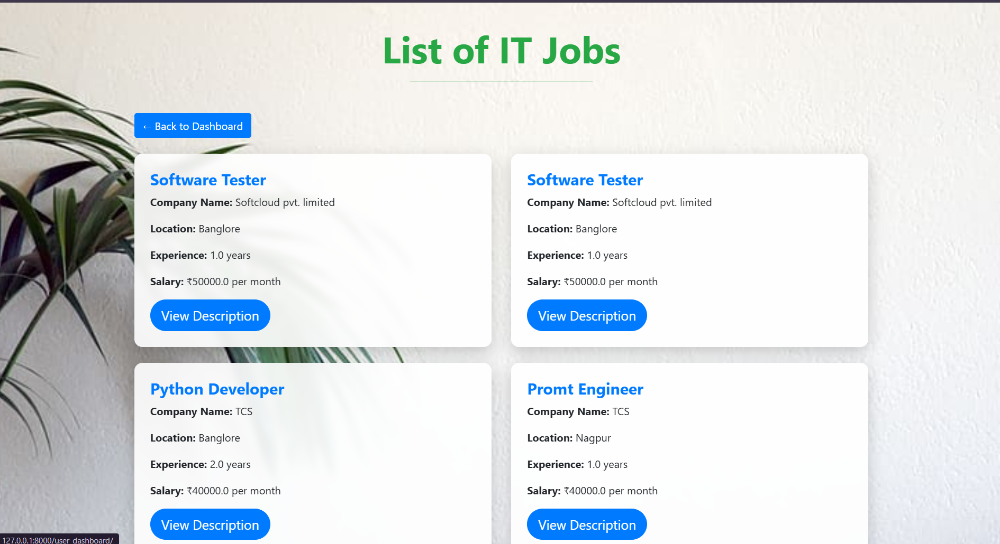
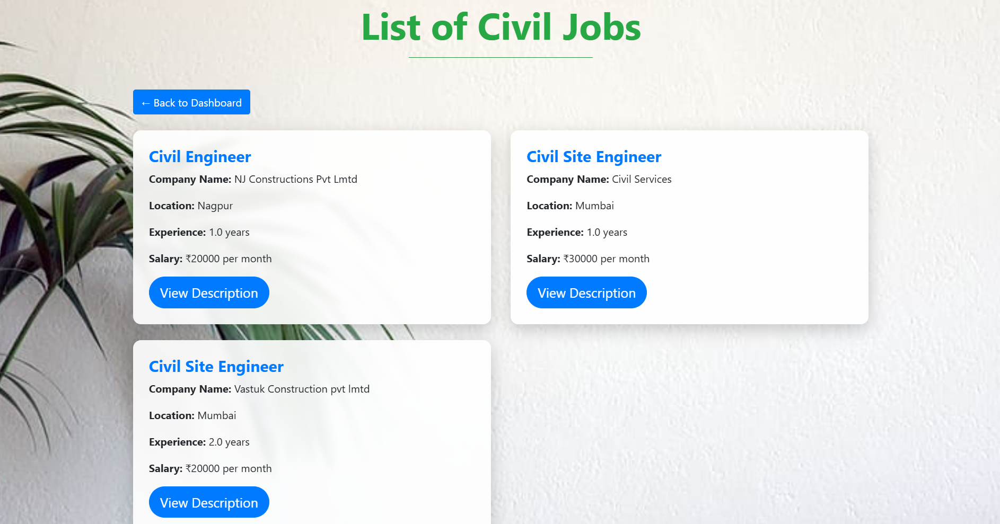
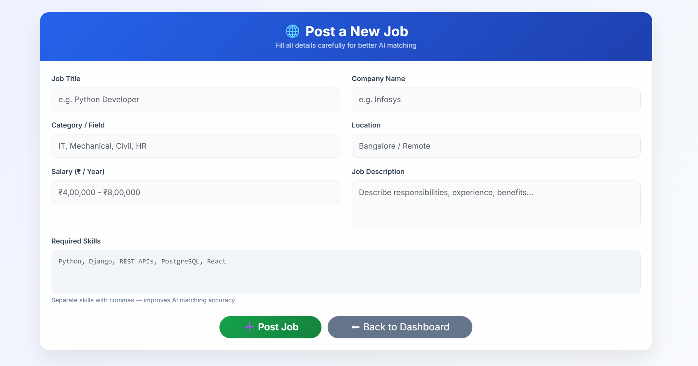
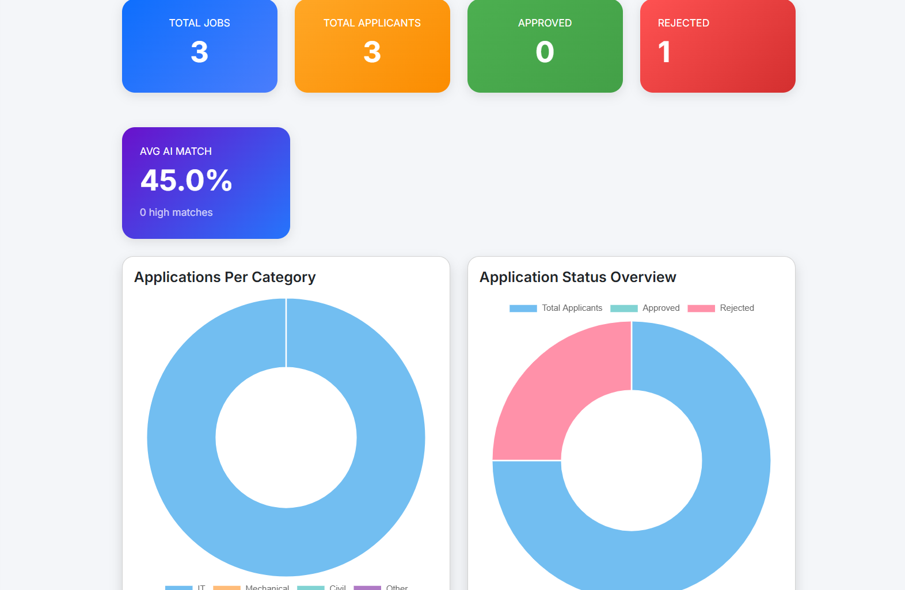
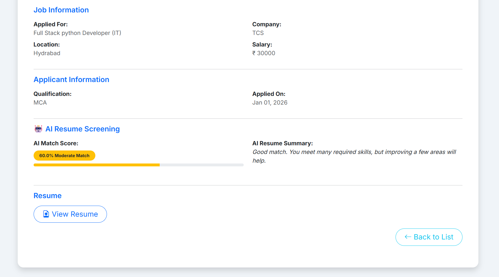
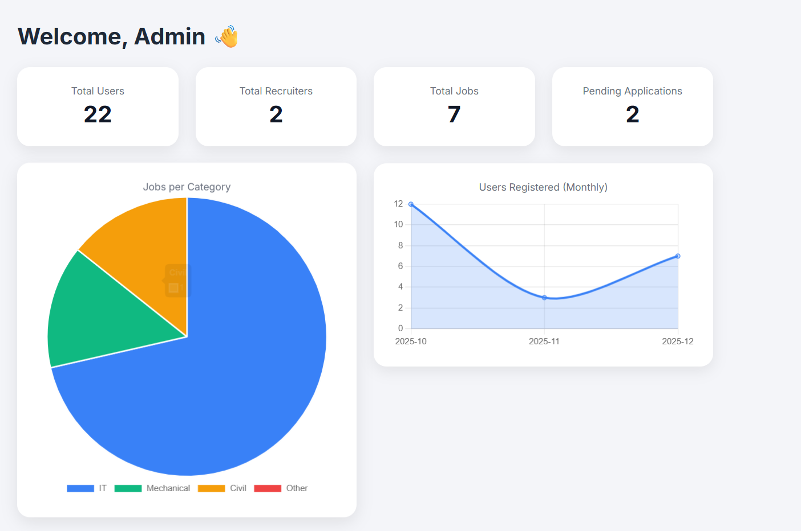

# 🤖 AI Job Portal (Python + Django + NLP)

\ AI-Based Job Portal 🧠💼

An intelligent, domain-aware job portal built using Django that leverages NLP and AI-based scoring to match resumes with job requirements across multiple domains including IT, Mechanical, and Civil engineering.

\🚀 Key Features

\- AI-powered resume-to-job matching using TF-IDF \& cosine similarity

\- Weighted skill scoring with domain-specific logic

\- Separate job flows for IT, Mechanical, Civil \& Other categories

\- Recruiter \& applicant dashboards

\- AI-generated feedback and match score for every application

\- Secure handling of user data (resumes \& media ignored via .gitignore)

\🧠 AI Logic

\- Extracts clean skills from resumes \& job descriptions

\- Applies weighted scoring for primary domain skills

\- Penalizes cross-domain mismatches

\- Generates human-readable AI feedback

\🛠 Tech Stack

\- Backend: Django, Python

\- AI/NLP: scikit-learn, TF-IDF, cosine similarity

\- Database: SQLite

\- Frontend: HTML, CSS, Bootstrap

\📌 Note

This repository intentionally excludes personal data such as resumes, media files, and databases for security reasons.

An intelligent job portal built using **Django** that automates resume screening using **NLP, weighted skill scoring, and domain-aware AI logic**.  
The platform supports **IT, Mechanical, and Civil** job domains with recruiter, admin, and user dashboards.

---

## 🚀 Key Features

- 🔍 AI-based Resume Screening & Match Scoring
- 🧠 NLP + TF-IDF + Cosine Similarity
- 🏢 Recruiter Dashboard with Job Analytics
- 👨‍💼 Admin Panel with User & Job Insights
- 👩‍💻 User Job Search & Application Tracking
- 📊 Visual analytics (charts & stats)
- 🔐 Role-based authentication (Admin / Recruiter / User)

---

## 🖥️ Screenshots

## 🏠 Home Page

## 👩🏻‍💻 IT Job Listings

## 👨🏼‍🔧 Mechanical Job Listings

## 👨🏼‍🔧 Civil Job Listings

## 📝 Post a Job

## 👔 Recruiter Dashboard

## 🧠 AI Resume Screening

## 🛠 Admin Dashboard

---

## 🧠 AI Matching Logic (Overview)

- Skill extraction using predefined skill sets
- Weighted primary skills per domain
- Resume–Job similarity using **TF-IDF + Cosine Similarity**
- Domain penalty to avoid false positives
- Final score with smart thresholding

---

## ⚙️ Tech Stack

- **Backend:** Django, Python
- **AI / NLP:** scikit-learn, TF-IDF, Cosine Similarity
- **Frontend:** HTML, CSS, Bootstrap
- **Database:** SQLite (development)
- **Charts:** Chart.js

---

## 🔒 Security & Privacy

- Resumes and user data are **NOT committed**
- `.gitignore` protects:
  - `db.sqlite3`
  - `media/`
  - uploaded resumes
  - environment files

---

## 📌 Future Enhancements

- Resume keyword heatmaps
- Job recommendation engine
- Resume parsing with spaCy
- Deployment (Docker / AWS)

---

## 👩‍💻 Author

**Diya Khere**  
Aspiring Software Developer | Django | AI-Driven Systems
